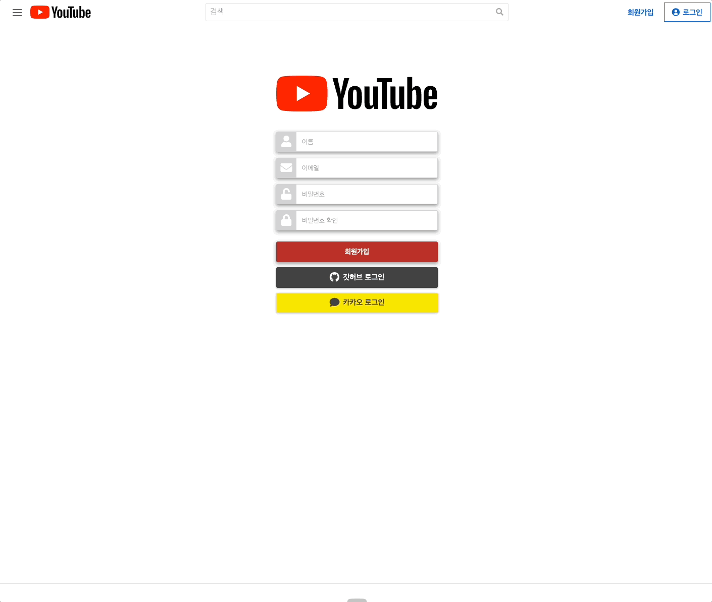
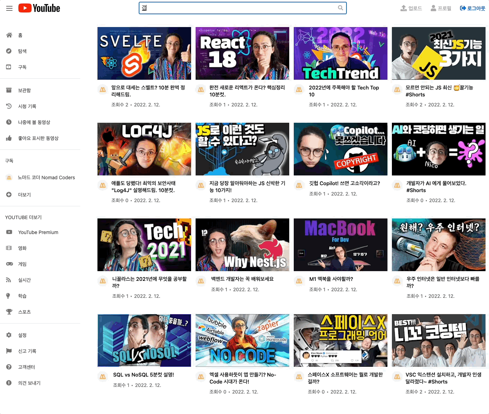
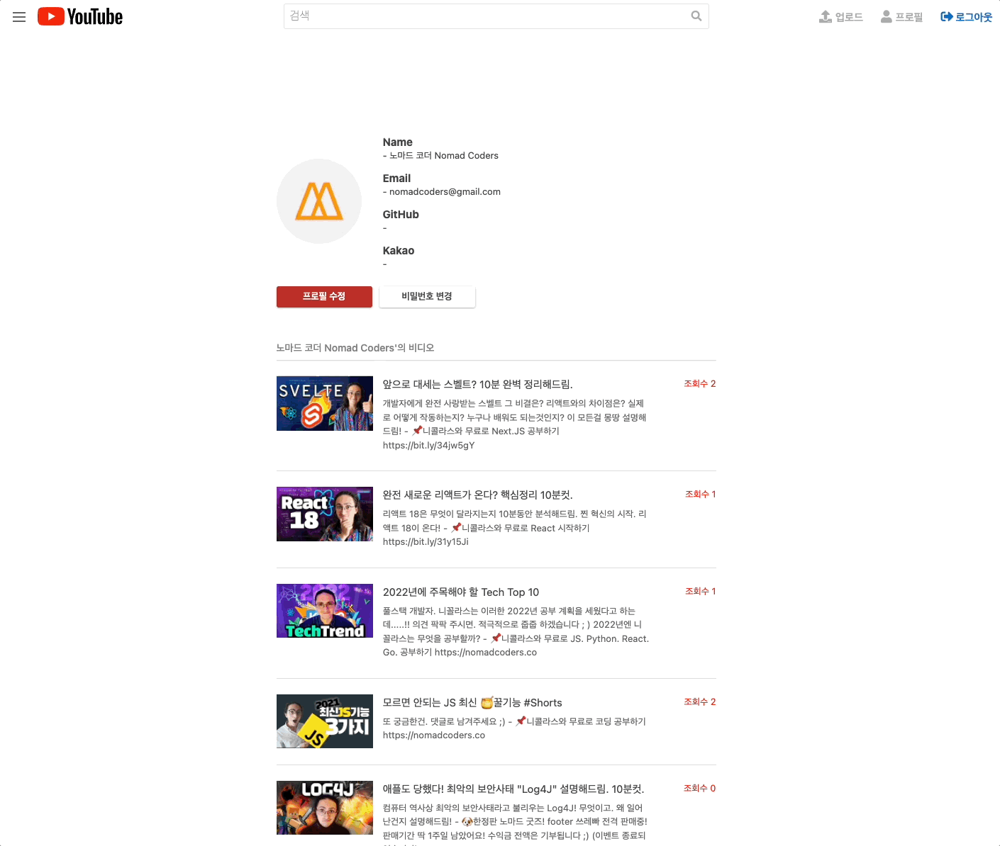
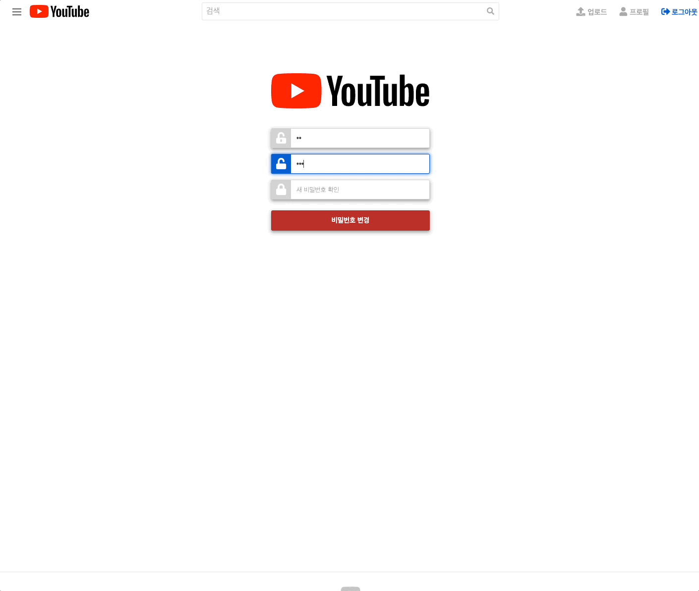

  <a href="https://youtube-gw.herokuapp.com">
    
      
    <a display="block" href="https://youtube-gw.herokuapp.com">https://youtube-gw.herokuapp.com</a>
      
    
  </a>

## Table of contents

- 🔥 [Built with](#built-with)
- 🌈 [Project](#project)
- 📑 [Pages](#pages)
- ⚙ [Features](#features)
- 📝 [License](#license)

## Built with

### Front-end

- `HTML`
- `CSS`
- `Typescript`
- `Pug`
- `SCSS`
- `Webpack`

### Back-end

- `NodeJS`
- `Express`
- `MongoDB`
- `Mongoose`
- `Bcrypt`
- `Multer`

### Deploy

- `AWS S3`
- `Heroku`

## Project

> 1. 회원가입, 로그인

- 유저는 이메일, 비밀번호를 이용해 회원가입을 할 수 있습니다.
- 기존의 깃허브 또는 카카오 계정을 이용해 소셜 로그인을 할 수 있습니다.
    
  

> 2. 비디오

- 커스터마이징된 비디오 플레이어를 통해 재생, 정지, 건너뛰기, 볼륨 조절, 전체 화면 등을 사용할 수 있습니다.
- 비디오에 댓글을 남기거나 삭제할 수 있습니다.
    
  

> 3. 검색

- 비디오의 제목으로 비디오를 검색할 수 있습니다.
- 비디오가 가진 해시태그를 클릭해 비디오를 검색할 수 있습니다.
    
  

> 4. 프로필

- 유저는 프로필 페이지에서 자신의 이메일 또는 깃허브, 카카오 아이디를 확인할 수 있습니다.
- 자신이 업로드한 전체 비디오 리스트를 확인할 수 있습니다.
- 로그인하지 않은 유저도 다른 유저의 프로필을 볼 수 있습니다.
    
  

> 5. 프로필 수정, 비밀번호 변경

- 프로필 수정 페이지에서 아바타, 이름, 이메일을 수정할 수 있습니다.
- 비밀번호 변경 페이지에서 기존 비밀번호를 새로운 비밀번호로 변경할 수 있습니다.
    
  

> 6. 비디오 녹화, 업로드

- 녹화 시작을 클릭해 웹캠을 이용하여 비디오를 녹화하고, 변환해서 다운로드받을 수 있습니다.
- 비디오의 제목, 해시태그, 설명을 입력해 비디오를 업로드할 수 있습니다.
    
  

## Pages

> Root

- 홈
- 회원가입
- 로그인
- 검색

> User

- 유저 프로필
- 프로필 수정
- 비밀번호 변경

> Video

- 비디오
- 비디오 업로드
- 비디오 수정

## Features

### 🙎‍♂️ User

- [x] 회원가입
- [x] 로그인 / 로그아웃
- [x] 깃허브 / 카카오 로그인
- [x] 아바타 업로드
- [x] 프로필 수정
- [x] 비밀번호 변경

### 📺 Video

- [x] 비디오 업로드
- [x] 비디오 수정 / 삭제
- [x] 비디오 검색
- [x] 비디오 녹화
- [x] 비디오 조회수 증가
- [x] 비디오 해시태그
- [x] 커스텀 비디오 플레이어

### 💬 Comment

- [x] 댓글 생성
- [x] 댓글 삭제

## License
